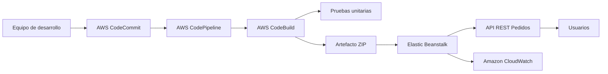

# API REST de Gestion de Pedidos en AWS

Proyecto base para el taller de implementacion automatizada de una plataforma de gestion de pedidos en AWS.

## Funcionalidades

- Crear pedidos con cliente, productos, cantidades y direccion de envio.
- Visualizar pedidos y filtrar por estado.
- Ordenar pedidos por fecha de creacion, estado o cliente.
- Consultar un pedido por identificador.
- Actualizar estado: `Pendiente`, `En Proceso`, `Enviado`, `Entregado`.
- Ejecutar pruebas unitarias en CI con AWS CodeBuild.
- Desplegar automaticamente con AWS CodePipeline hacia Elastic Beanstalk.

## Ejecutar localmente

```bash
npm install
npm test
npm start
```

La API queda disponible en `http://localhost:3000`.

## Endpoints

### Salud

```http
GET /health
```

### Crear pedido

```http
POST /orders
Content-Type: application/json
```

```json
{
  "customer": {
    "name": "Ana Gomez",
    "email": "ana@example.com"
  },
  "products": [
    {
      "sku": "SKU-1",
      "name": "Camisa",
      "quantity": 2
    }
  ],
  "shippingAddress": "Calle 10 # 20-30"
}
```

### Listar, filtrar y ordenar

```http
GET /orders?status=Pendiente&sortBy=createdAt&sortOrder=desc
```

Valores de `sortBy`: `createdAt`, `status`, `customer`.

### Consultar pedido

```http
GET /orders/{id}
```

### Actualizar estado

```http
PATCH /orders/{id}/status
Content-Type: application/json
```

```json
{
  "status": "Enviado"
}
```

## Pipeline AWS

La plantilla [infrastructure/cloudformation-pipeline.yml](infrastructure/cloudformation-pipeline.yml) crea:

- Repositorio AWS CodeCommit.
- Bucket S3 para artefactos.
- Proyecto AWS CodeBuild que ejecuta `buildspec.yml`.
- Pipeline AWS CodePipeline con etapas Source, Build y DeployTest.
- Aplicacion y entorno Elastic Beanstalk.

## Despliegue sugerido

1. Crear el stack de CloudFormation usando `infrastructure/cloudformation-pipeline.yml`.
2. Clonar el repositorio CodeCommit creado por el stack.
3. Copiar este codigo al repositorio CodeCommit.
4. Confirmar y subir cambios a la rama `main`.
5. Verificar que CodePipeline ejecute Source, Build y DeployTest.
6. Abrir la URL del entorno Elastic Beanstalk y probar `/health` y `/orders`.

## Arquitectura


